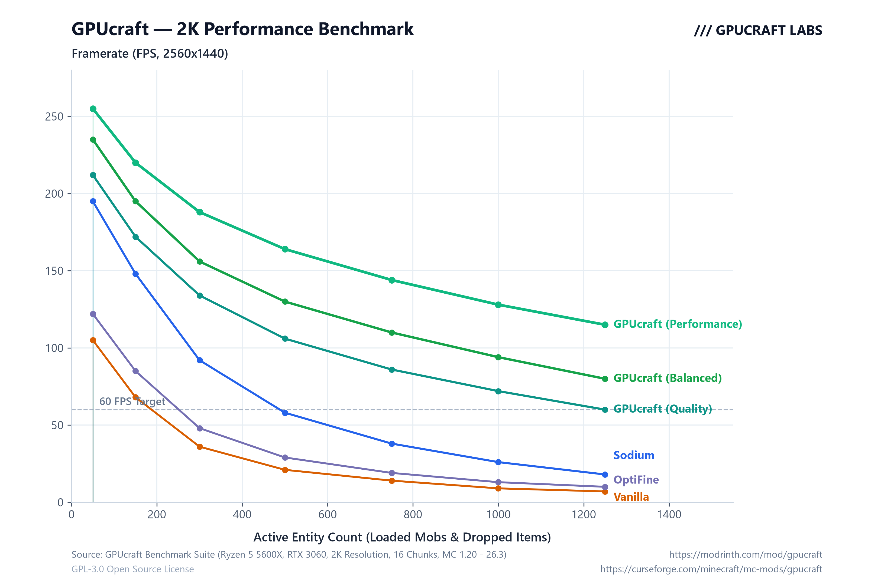

# GPUcraft

Client-side rendering optimization mod for Fabric that eliminates CPU draw overhead and stabilizes framerates in entity-heavy scenes.

---

## Repository Structure

Source code for each supported Minecraft version is organized in the [`versions/`](versions/) directory:

- 📂 [`versions/1.20.1/`](versions/1.20.1/) — Minecraft 1.20.1 (Fabric)
- 📂 [`versions/1.21/`](versions/1.21/) — Minecraft 1.21.x (Fabric)
- 📂 [`versions/26.1/`](versions/26.1/) — Minecraft 26.1 (Fabric)
- 📂 [`versions/26.2/`](versions/26.2/) — Minecraft 26.2 (Fabric)
- 📂 [`versions/26.3/`](versions/26.3/) — Minecraft 26.3 (Fabric)

---

## Key Features

- **Vulkan-Style State Caching**: Skips redundant OpenGL driver state switches (`glBindTexture`, `glDepthMask`, `glBlendFunc`), cutting CPU-to-GPU overhead.
- **Occlusion Culling**: Fast raycast culling with zero per-frame heap allocations; stops rendering mobs hidden behind solid blocks.
- **Frustum Culling**: Bypasses rendering for entities outside the camera view cone.
- **Distance Limits**: Independent render distance limits for entities and block entities (chests, signs, banners).
- **Particle & Drop Budgets**: Caps spawned particles and dropped items to prevent freezes during explosions and mob farm operations.
- **Weather Toggle**: Option to disable rain/snow rendering to save GPU fillrate.
- **FPS Throttling**: Configurable in-game FPS cap and background throttling when unfocused.
- **Live Diagnostics HUD**: Real-time FPS, active GPU, and culling statistics.

---

## Controls

- **`F9`**: Toggle Diagnostics HUD
- **`F10`**: Cycle Presets (`Quality` → `Balanced` → `Performance`)

*(Customizable via Mod Menu or vanilla Controls settings)*

---

## Presets

| Preset | Entity Dist | Block Entities | Particles | Max Items | Occlusion | Weather | Target |
| :--- | :---: | :---: | :---: | :---: | :---: | :---: | :--- |
| **Quality** | 128 | 96 | 96 | Unlimited | Off | On | High-end PCs, shaders |
| **Balanced** | 64 | 48 | 48 | Unlimited | On | On | Default gameplay |
| **Performance** | 28 | 20 | 20 | 96 | On | Off | Mob farms, low-end GPUs |

---

## Requirements

- **Fabric Loader** `>= 0.16.0`
- **Fabric API**
- **Java 21+** *(Java 17 for 1.20.1)*

---

## Benchmark

---

## Links & License

- **Source Code**: [https://github.com/kors-developer/GPUcraft](https://github.com/kors-developer/GPUcraft)
- **Developer**: [https://github.com/kors-developer](https://github.com/kors-developer)
- **CurseForge**: [https://curseforge.com/minecraft/mc-mods/gpucraft](https://curseforge.com/minecraft/mc-mods/gpucraft)
- **Modrinth**: *Coming Soon* ([https://modrinth.com/mod/gpucraft](https://modrinth.com/mod/gpucraft))

This project is licensed under the [GNU General Public License v3.0 (GPLv3)](https://www.gnu.org/licenses/gpl-3.0.html).  
Copyright (C) 2026 kors228.
